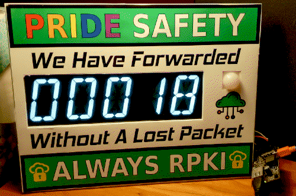

# SFMIX _{days since}_ accident sign

## History
[SFMIX](https://sfmix.org/) is an [internet exchange](https://www.euro-ix.net/en/forixps/) based in San Francisco. An outage occured on November 14th, 2019 at 11:32 _(local Pacific time)_ for approximately 2 hours. Internet infrastructure outages are fairly infamous. This clock commemorates this event and has been _(magnetically)_ mounted at the SFMIX cabinet located in [Hurricane Electric](https://he.net/colocation.html)'s FMT2 facility in Fremont, California. SFMIX has been in _{quasi}_ continuous operation since mid 2006.

The sign was built around the theme of a _"days since"_ work place accident sign. A motion sensor triggers the sign to turn on for a few seconds while people walk past. An ESP32 controls the sign via TTL serial, the clock is synced with NTP and backed by an RTC for good measure. The LED sign itself is an existing commerical product from [Evil Mad Scientist](https://www.evilmadscientist.com/). A [custom sticker](images/sfmix_accident_sign_sticker.pdf) was made to encourage the use of [RPKI](https://www.arin.net/resources/manage/rpki/), a method of signalling routing information under a mutal trust security model. 

### Shopping list
* [Alpha Clock Five](https://wiki.evilmadscientist.com/Alpha_Clock_Five) 2.3" LED clock _(We used the [white Basic Edition](https://shop.evilmadscientist.com/productsmenu/tinykitlist/613))_
* [wESP32](https://wesp32.com/) Power over Ethernet ESP32 w/ 12V output
* [SparkFun OpenPIR](https://www.sparkfun.com/products/13968) motion sensor
* [DS3231](https://www.jameco.com/z/277258VP-Major-Brands-IC-DS3231-Real-Time-Clock-DS3231-Module-Breakout-Board-with-Super-Capacitor_2217625.html) Real Time Clock
* 22 guage wire, solder, heatshrink, zip ties, scrap acrylic sheets, magnets, bolts, _plenty of patience_

### Credits
* [Matt Peterson](https://github.com/dorkmatt) Concept, code, soldering
* [Rob Liesenfeld](https://github.com/xunil) Laser cutting, mastery of acrylic arts, prototyping-as-a-service
* [Tris Horn](https://tris.net/) Sticker-printing-as-a-service, CMYK expert

_Note: No SFMIX funds were utilized in the creation of this project, all materials and engineering resources were donated._

